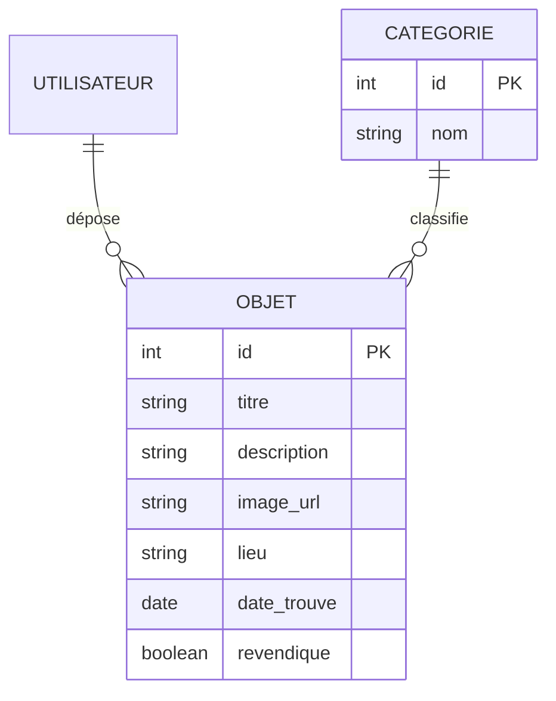

### Titre du projet  
**DevinciLostFound – Plateforme intelligente de gestion des objets perdus et trouvés**

---

### Description du projet  

**DevinciLostFound** est une application multiplateforme (Web, Android, iOS) destinée aux étudiants et au personnel de l’école Léonard de Vinci à Paris, permettant de signaler un objet trouvé ou de rechercher un objet perdu.  

Lorsqu’un utilisateur trouve un objet, il peut :  
- téléverser une photo,  
- ajouter une description et le lieu de découverte,  
- et publier sans avoir besoin de se connecter.  

L’image est automatiquement floutée par une IA afin de cacher l’objet, puis une modération automatique vérifie que le contenu n’est pas inapproprié.  

Quand une personne recherche un objet perdu, elle peut :  
- saisir des mots-clés (titre, type d’objet, couleur, etc.) pour le retrouver,  
- proposer une description précise de l’objet,  
- et si sa description correspond à celle du déposant (vérifiée par IA), l’image originale se défloute et les coordonnées du trouveur deviennent visibles.  

La plateforme repose sur un **backend Java Spring Boot** relié à une **base PostgreSQL**, une **interface React**, et des **outils IA open source** (*Ollama*, *Whisper*, *OpenCV*).  

Ce projet favorise la **collaboration**, la **responsabilité** et la **sécurité** au sein de la communauté étudiante.

### Diagramme entité-relation (Mermaid)



### Technologies utilisées

| Domaine | Outil / Langage | Détails |
|----------|------------------|---------|
| **Base de données (SQL)** | PostgreSQL | Stockage des objets et utilisateurs |
| **Web sémantique (RDF / Turtle)** | RDF Turtle (via Jena ou fichier `.ttl`) | Description sémantique des objets (catégorie, lieu, date, etc.) |
| **Backend** | Java Spring Boot | Fournit une API REST pour gérer les objets et interagir avec les outils IA |
| **Frontend** | React (JavaScript) | Interface web pour l’ajout, la recherche et la visualisation des objets |
| **IA locale** | Ollama | Analyse des descriptions, vérification de similarité et modération de contenu |
| **Reconnaissance vocale** | Whisper | Conversion de descriptions vocales en texte |
| **Traitement d’image** | OpenCV (Python) | Détection et floutage automatique de l’objet dans les images |
| **CMS documentaire** | Omeka S | Gestion des métadonnées et intégration des objets trouvés dans une base documentaire |
| **Documentation** | Markdown | README + diagrammes Mermaid pour la structure du projet |

### Structure du projet (proposée)

Voici l’organisation recommandée des dossiers du projet **DevinciLostFound** :

```plaintext
DevinciLostFound/
│
├── backend/                # API Spring Boot (Java)
│   ├── src/main/java/com/devinci/lostfound/
│   └── resources/
│
├── ai/                     # Scripts Python (floutage, audio)
│   ├── blur_image.py
│   └── transcribe_audio.py
│
├── frontend/               # Interface React (JavaScript)
│   └── src/
│
├── omeka/                  # Installation locale de Omeka S
│
└── README.md               # Documentation du projet
```
## Utilisation des outils demandés

Ce projet exploite plusieurs outils d’intelligence artificielle et de gestion documentaire demandés dans le cadre du cours :

- **Ollama** : moteur d’IA local permettant d’exécuter des modèles comme *Llama3* pour comparer les descriptions, vérifier les similarités et modérer le contenu (texte ou image).  
- **Anything LLM** : interface libre et locale connectée à Ollama, utilisée pour tester les requêtes en langage naturel et interagir avec les données du projet.  
- **Whisper** : outil de reconnaissance vocale open source d’OpenAI permettant de convertir les descriptions vocales des objets en texte.  
- **Omeka S** : CMS documentaire open source pour organiser et publier les fiches d’objets trouvés sous forme de collections numériques.  
- **Mermaid** : générateur de diagrammes intégré au Markdown, utilisé ici pour représenter le diagramme entité–relation directement dans le README.

##  Langages utilisés (exigés par le professeur)

| Langage | Utilisation |
|----------|--------------|
| **SQL** | Utilisé avec PostgreSQL pour stocker les objets, les catégories et les utilisateurs |
| **RDF / Turtle** | Employé pour décrire les métadonnées sémantiques des objets dans un fichier `.ttl` (catégorie, lieu, date, etc.) |
| **Java (Spring Boot)** | Utilisé pour le backend et la création de l’API REST permettant de gérer les objets et de communiquer avec les outils d’IA |
| **JavaScript (React)** | Utilisé dans le frontend pour concevoir l’interface utilisateur, la recherche et l’affichage des objets |
| **Markdown** | Utilisé pour la documentation du projet, la rédaction du README et l’intégration des diagrammes Mermaid |

---

## Résumé

Le projet **DevinciLostFound** répond à toutes les exigences du cours :  
- utilisation des **cinq langages imposés** ;  
- intégration de plusieurs **outils d’intelligence artificielle open source** (Ollama, Whisper, Anything LLM, OpenCV) ;  
- ajout d’un **CMS documentaire (Omeka S)** pour la gestion et la visualisation des objets ;  
- documentation complète avec **diagrammes Mermaid** et **syntaxe Markdown**.  

**Objectif final :** proposer une solution éthique, intelligente et collaborative pour la gestion des objets perdus et trouvés au sein du campus Léonard de Vinci.
 
