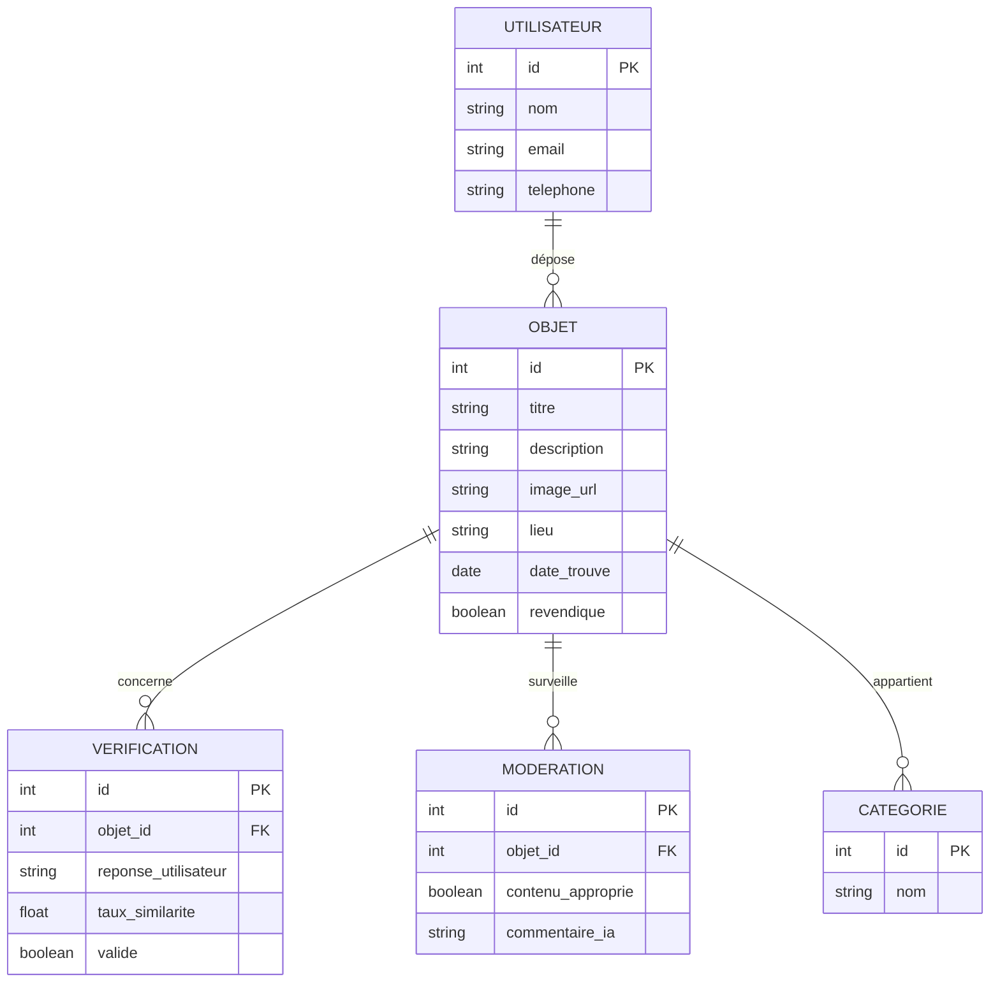

### Titre du projet  
**DevinciLostFound – Plateforme intelligente de gestion des objets perdus et trouvés**

---

### Description du projet  

**DevinciLostFound** est une application multiplateforme (Web, Android, iOS) destinée aux étudiants et au personnel de l’école Léonard de Vinci à Paris, permettant de signaler un objet trouvé ou de rechercher un objet perdu.  

Lorsqu’un utilisateur trouve un objet, il peut :  
- téléverser une photo,  
- ajouter une description et le lieu de découverte,  
- et publier sans avoir besoin de se connecter.  

L’image est automatiquement floutée par une IA afin de cacher l’objet, puis une modération automatique vérifie que le contenu n’est pas inapproprié.  

Quand une personne recherche un objet perdu, elle peut :  
- saisir des mots-clés (titre, type d’objet, couleur, etc.) pour le retrouver,  
- proposer une description précise de l’objet,  
- et si sa description correspond à celle du déposant (vérifiée par IA), l’image originale se défloute et les coordonnées du trouveur deviennent visibles.  

La plateforme repose sur un **backend Java Spring Boot** relié à une **base PostgreSQL**, une **interface React**, et des **outils IA open source** (*Ollama*, *OpenCV*).  

Ce projet favorise la **collaboration**, la **responsabilité** et la **sécurité** au sein de la communauté étudiante.

### Diagramme entité-relation (Mermaid)



### Technologies utilisées

| Domaine | Outil / Langage | Détails |
|----------|------------------|---------|
| **Base de données (SQL)** | PostgreSQL | Stockage des objets et utilisateurs |
| **Backend** | Java Spring Boot | Fournit une API REST pour gérer les objets et interagir avec les outils d’IA |
| **Frontend** | React (Typescript) | Interface web pour l’ajout, la recherche et la visualisation des objets |
| **IA locale** | Ollama | Analyse des descriptions, vérification de similarité et modération de contenu |
| **Traitement d’image** | OpenCV (Python) | Détection et floutage automatique de l’objet dans les images |
| **Documentation** | Markdown | README + diagrammes Mermaid pour la structure du projet |


### Structure du projet (proposée)

Voici l’organisation recommandée des dossiers du projet **DevinciLostFound** :

```plaintext
DevinciLostFound/
│
├── backend/                           # Backend Java Spring Boot (API REST)
│   ├── src/main/java/com/devinci/lostfound/
│   ├── src/main/resources/
│   ├── pom.xml                        # Configuration Maven
│   └── Dockerfile                     # Image backend (Spring Boot)
│
├── ai/                                # Scripts Python pour l’IA locale
│   ├── blur_image.py                  # Détection et floutage automatique d’objets (OpenCV)
│   ├── ollama_service.py              # Communication avec Ollama pour similarité/modération
│   └── Dockerfile                     # Image AI (Python + OpenCV + Ollama client)
│
├── frontend/                          # Frontend React (TypeScript)
│   ├── src/
│   ├── public/
│   ├── package.json                   # Configuration React
│   └── Dockerfile                     # Image frontend (React)
│
├── database/                          # Scripts SQL et configuration PostgreSQL
│   ├── init.sql
│   └── Dockerfile                     # (optionnel) Image custom PostgreSQL avec données initiales
│
├── docker-compose.yml                 # Orchestration des services (backend, frontend, db, ai)
│
└── README.md                          # Documentation principale du projet
```
## Utilisation des outils d’intelligence artificielle

Ce projet exploite plusieurs outils d’intelligence artificielle open source pour améliorer la fiabilité et l’efficacité du système **DevinciLostFound** :

- **Ollama** : moteur d’IA local permettant d’exécuter des modèles tels que *Llama3* pour comparer les descriptions des objets, évaluer leur similarité et modérer les contenus textuels.  
- **OpenCV** : bibliothèque Python utilisée pour la détection automatique d’objets dans les images et l’application d’un floutage afin de masquer temporairement les objets trouvés.  


## Langages et outils utilisés

| Langage / Outil | Utilisation |
|------------------|--------------|
| **SQL** | Utilisé avec PostgreSQL pour stocker les objets, les catégories et les utilisateurs |
| **Java (Spring Boot)** | Utilisé pour le backend : création de l’API REST, communication avec la base de données et les services d’IA |
| **Python (OpenCV)** | Utilisé pour la détection automatique et le floutage des objets dans les images, ainsi que pour la communication avec Ollama |
| **TypeScript (React)** | Utilisé pour le frontend : interface utilisateur, affichage dynamique des objets et interactions avec l’API |
| **Markdown** | Utilisé pour la documentation du projet, la rédaction du README et l’intégration de diagrammes Mermaid |
| **Docker / Docker Compose** | Utilisé pour conteneuriser l’application complète (backend, frontend, base de données et services IA) afin de simplifier le déploiement et l’exécution |

---

## Résumé

Le projet **DevinciLostFound** est une plateforme intelligente et collaborative dédiée à la gestion des objets perdus et trouvés au sein du campus Léonard de Vinci.  
Cette version bêta repose sur une architecture moderne et conteneurisée, combinant **Spring Boot**, **React**, **PostgreSQL**, **Ollama**, **OpenCV** et **Docker**.

Le projet répond aux objectifs du cours en intégrant :  
- plusieurs **langages et technologies open source** (Java, Typescript, Python, SQL, Markdown) ;  
- des **outils d’intelligence artificielle** (Ollama pour le raisonnement et la modération, OpenCV pour le floutage automatique) ;  
- une **infrastructure Docker** facilitant l’installation, l’exécution et le déploiement multi-services ;  
- une **documentation claire** en Markdown avec diagrammes Mermaid pour la structure et les entités.  

**Objectif final :** offrir une solution simple, sécurisée et intelligente pour aider les étudiants et le personnel à retrouver leurs objets tout en favorisant la collaboration et la responsabilité au sein de la communauté du campus Léonard de Vinci.

 
